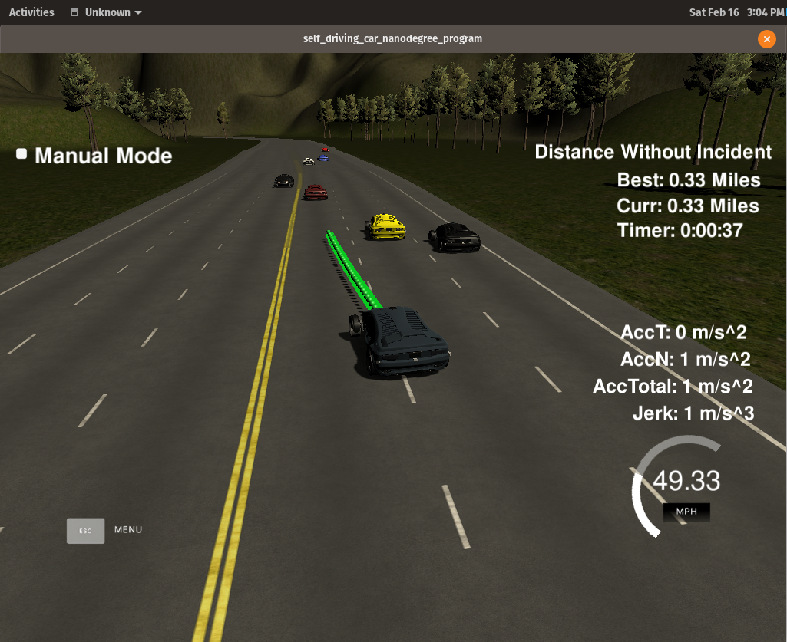

# Path Planning Simulation

Udacity [Self-Driving Car Engineer Nanodegree](https://www.udacity.com/course/self-driving-car-engineer-nanodegree--nd013)


### Simulator.
You can download the Term3 Simulator which contains the Path Planning Project from the [releases tab (https://github.com/udacity/self-driving-car-sim/releases/tag/T3_v1.2).  

To run the simulator on Mac/Linux, first make the binary file executable with the following command:
```shell
sudo chmod u+x {simulator_file_name}
```

### Goals
In this project your goal is to safely navigate around a virtual highway with other traffic that is driving +-10 MPH of the 50 MPH speed limit. You will be provided the car's localization and sensor fusion data, there is also a sparse map list of waypoints around the highway. The car should try to go as close as possible to the 50 MPH speed limit, which means passing slower traffic when possible, note that other cars will try to change lanes too. The car should avoid hitting other cars at all cost as well as driving inside of the marked road lanes at all times, unless going from one lane to another. The car should be able to make one complete loop around the 6946m highway. Since the car is trying to go 50 MPH, it should take a little over 5 minutes to complete 1 loop. Also the car should not experience total acceleration over 10 m/s^2 and jerk that is greater than 10 m/s^3.

#### The map of the highway is in data/highway_map.txt
Each waypoint in the list contains  [x,y,s,dx,dy] values. x and y are the waypoint's map coordinate position, the s value is the distance along the road to get to that waypoint in meters, the dx and dy values define the unit normal vector pointing outward of the highway loop.

The highway's waypoints loop around so the frenet s value, distance along the road, goes from 0 to 6945.554.

## Basic Build Instructions

1. Clone this repo.
2. Make a build directory: `mkdir build && cd build`
3. Compile: `cmake .. && make`
4. Run it: `./path_planning`.

Here is the data provided from the Simulator to the C++ Program

## Dependencies

* cmake >= 3.5
  * All OSes: [click here for installation instructions](https://cmake.org/install/)
* make >= 4.1
  * Linux: make is installed by default on most Linux distros
  * Mac: [install Xcode command line tools to get make](https://developer.apple.com/xcode/features/)
  * Windows: [Click here for installation instructions](http://gnuwin32.sourceforge.net/packages/make.htm)
* gcc/g++ >= 5.4
  * Linux: gcc / g++ is installed by default on most Linux distros
  * Mac: same deal as make - [install Xcode command line tools]((https://developer.apple.com/xcode/features/)
  * Windows: recommend using [MinGW](http://www.mingw.org/)
* [uWebSockets](https://github.com/uWebSockets/uWebSockets)
  * Run either `install-mac.sh` or `install-ubuntu.sh`.
  * If you install from source, checkout to commit `e94b6e1`, i.e.
    ```
    git clone https://github.com/uWebSockets/uWebSockets 
    cd uWebSockets
    git checkout e94b6e1
    ```
    
## Implementation
Udacity provided a number of helper functions in [main.cpp](./src/main.cpp). My implementation occurred in the telemetry section of the function h.onMessage(), between lines 235 and 448.

This project implements [cubic splines](https://en.wikipedia.org/wiki/Spline_(mathematics)) to generate smooth trajectories. This is similar to an implementation provided in [Udacity's walk-through video](https://www.youtube.com/watch?v=7sI3VHFPP0w).


### Prediction and Decision

This step analyzes the localization and sensor fusion data for all cars on the same side of the track, including the ego vehicle.

In lines [264](./src/main.cpp#L264) to [310](./src/main.cpp#L310) of `main.cpp`, the positions of all the other vehicles are analyzed relative to the ego vehicle. If the ego vehicle is within 30 meters of the vehicle in front, the boolean too_close is flagged true. If vehicles are within that margin on the left or right, car_left or car_right are flagged true, respectively.

In lines [313](./src/main.cpp#L313) to [341](./src/main.cpp#L341) of `main.cpp`, decisions are made on how to adjust speed and change lanes. If a car is ahead within the gap, the lanes to the left and right are checked. If one of them is empty, the car will change lanes. Otherwise it will slow down.

The car will move back to the center lane when it becomes clear. This is because a car can move both left and right from the center lane, and it is more likely to get stuck going slowly if on the far left or right.

If the area in front of the car is clear, no matter the lane, the car will speed up.

### Trajectory Generation

Lines [344](./src/main.cpp#L344) to [448](./src/main.cpp#L448) of `main.cpp` compute the trajectory of the vehicle from the decisions made above, the vehicle's position, and historical path points. 

In lines [344](./src/main.cpp#L344) to [407](./src/main.cpp#L407) of main.cpp, the last two points in the already-covered terrain are computed. If the vehicle has not yet moved 60 meters, the vehicle's current position is used instead of the historical waypoints. In addition, the Frenet helper function getXY() is used to generate three points spaced evenly at 30 meters in front of the car

Because splines are the method used to generate the trajectory, a shift and rotate transform is applied.

In lines [407](./src/main.cpp#L407) to [448](./src/main.cpp#L448) of `main.cpp`, the computed waypoints are transformed using a spline. The spline makes it relatively easy to compute a smooth trajectory in 2D space while taking into account acceleration and velocity.

## Data used in the project

#### Main car's localization Data (No Noise)

["x"] The car's x position in map coordinates

["y"] The car's y position in map coordinates

["s"] The car's s position in frenet coordinates

["d"] The car's d position in frenet coordinates

["yaw"] The car's yaw angle in the map

["speed"] The car's speed in MPH

#### Previous path data given to the Planner

//Note: Return the previous list but with processed points removed, can be a nice tool to show how far along
the path has processed since last time. 

["previous_path_x"] The previous list of x points previously given to the simulator

["previous_path_y"] The previous list of y points previously given to the simulator

#### Previous path's end s and d values 

["end_path_s"] The previous list's last point's frenet s value

["end_path_d"] The previous list's last point's frenet d value

#### Sensor Fusion Data, a list of all other car's attributes on the same side of the road. (No Noise)

["sensor_fusion"] A 2d vector of cars and then that car's [car's unique ID, car's x position in map coordinates, car's y position in map coordinates, car's x velocity in m/s, car's y velocity in m/s, car's s position in frenet coordinates, car's d position in frenet coordinates. 

